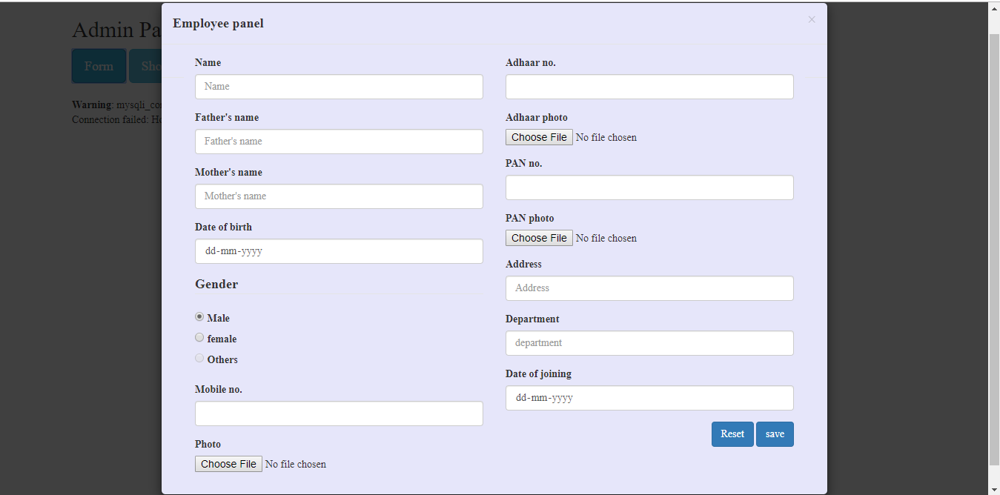

<h1 align="center">Customer-Item-Allotment-Form</h1>

(Customer Item-Allotment Online Form which can be used by the shopkeepers and small business men to keep track of their Items and customer as well)

---

I built a Customer Item-Allotment Online Form which can be used by the shopkeepers and small business men to keep the details of the customers and the Items. The form generates the list of Items and the customer details to keep the track of their products.  

The Project contains the five Panels-  
- Admin Panel(for the Company)  
- Customer Detail Form (for the shopkeeper)  
- Item Details Form (for the shopkeeper)  
- Item-Allotment Form (for the shopkeeper)  
- Invoice Form (for the user)  

The language used-  
- Back-end languages like php, python etc.  
- Front-end languages like Ajax, jQuery, JavaScript, Html, Css etc.  
- Database - phpMyAdmin, MySQL. 
- Software Used (Server) - Xampp(Windows), VS Code(IDE).

---

## Screenshots

